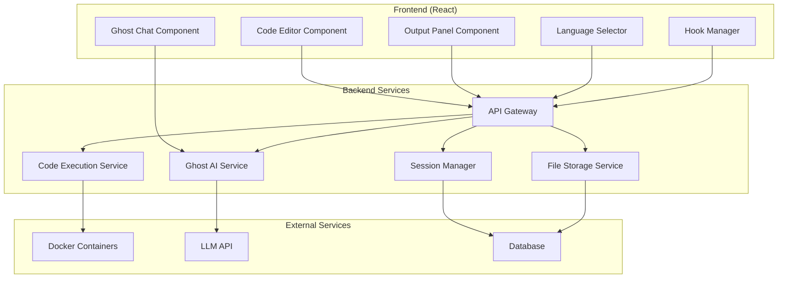

# Design Document

## Overview

GhostIDE is architected as a modern web application with a React-based frontend and a Node.js backend. The system uses a microservices approach where the code execution engine runs in isolated containers for security. The Ghost AI assistant integrates with the OpenAI API or similar LLM service, with custom prompting to maintain the spooky persona. Real-time communication between frontend and backend uses WebSockets for immediate feedback on code execution and AI interactions.

## Architecture

### High-Level Architecture



### Technology Stack

**Frontend:**
- React 18 with TypeScript for type safety
- Monaco Editor (VS Code editor) for advanced code editing features
- Socket.io-client for real-time communication
- Tailwind CSS with custom spooky theme
- Zustand for state management

**Backend:**
- Python with FastAPI framework
- WebSockets with FastAPI's native WebSocket support
- Docker for code execution isolation
- Redis for session storage and caching
- PostgreSQL for persistent data storage
- Celery with Redis broker for managing code execution jobs

**Infrastructure:**
- Docker containers for each supported language runtime
- Nginx as reverse proxy and load balancer
- Rate limiting and security middleware

## Components and Interfaces

### Frontend Components

#### CodeEditor Component
```typescript
interface CodeEditorProps {
  language: string;
  value: string;
  onChange: (value: string) => void;
  onSave: () => void;
  theme: 'ghost-dark' | 'ghost-light';
}
```

Responsibilities:
- Syntax highlighting and autocomplete
- Code formatting and validation
- Keyboard shortcuts and editor preferences
- Integration with save hooks

#### OutputPanel Component
```typescript
interface OutputPanelProps {
  output: ExecutionResult;
  isExecuting: boolean;
  onClear: () => void;
}

interface ExecutionResult {
  stdout: string;
  stderr: string;
  exitCode: number;
  executionTime: number;
}
```

Responsibilities:
- Display execution results with syntax highlighting
- Show execution status and timing
- Handle streaming output for long-running processes
- Error formatting with line number references

#### GhostChat Component
```typescript
interface GhostChatProps {
  messages: ChatMessage[];
  onSendMessage: (message: string) => void;
  isTyping: boolean;
  ghostPersonality: GhostPersonality;
}

interface ChatMessage {
  id: string;
  content: string;
  sender: 'user' | 'ghost';
  timestamp: Date;
  context?: CodeContext;
}
```

Responsibilities:
- Chat interface with spooky styling
- Message history and context preservation
- Typing indicators and animations
- Integration with hook events

### Backend Services

#### Code Execution Service
```python
from typing import Optional, List
from pydantic import BaseModel

class ExecutionRequest(BaseModel):
    code: str
    language: str
    input: Optional[str] = None
    timeout: int
    session_id: str

class ExecutionResult(BaseModel):
    stdout: str
    stderr: str
    exit_code: int
    execution_time: float

class CodeExecutionService:
    async def execute_code(self, request: ExecutionRequest) -> ExecutionResult:
        pass
    
    def get_supported_languages(self) -> List[str]:
        pass
    
    def validate_code(self, code: str, language: str) -> bool:
        pass
```

Responsibilities:
- Manage Docker containers for code execution
- Handle timeouts and resource limits
- Sanitize and validate user input
- Stream execution output in real-time

#### Ghost AI Service
```python
from typing import List
from pydantic import BaseModel

class AIContext(BaseModel):
    chat_history: List[dict]
    current_code: str
    language: str
    recent_errors: List[str]

class CodeGenerationRequest(BaseModel):
    description: str
    language: str
    context: str

class GhostAIService:
    async def generate_response(self, prompt: str, context: AIContext) -> str:
        pass
    
    async def react_to_event(self, event: dict, context: dict) -> str:
        pass
    
    async def generate_code_snippet(self, request: CodeGenerationRequest) -> str:
        pass
```

Responsibilities:
- Maintain spooky persona through custom prompting
- Context-aware responses based on code and history
- Integration with LLM APIs
- Response caching and rate limiting

## Data Models

### User Session
```python
from datetime import datetime
from typing import List, Optional
from pydantic import BaseModel

class CodeFile(BaseModel):
    id: str
    name: str
    content: str
    language: str
    last_modified: datetime

class UserPreferences(BaseModel):
    theme: str
    font_size: int
    auto_save: bool

class UserSession(BaseModel):
    id: str
    files: List[CodeFile]
    current_language: str
    chat_history: List[dict]
    preferences: UserPreferences
    created_at: datetime
    last_activity: datetime
```

### Hook Events
```typescript
interface HookEvent {
  type: 'on_run' | 'on_error' | 'on_save';
  sessionId: string;
  timestamp: Date;
  data: {
    code?: string;
    error?: string;
    output?: string;
    language?: string;
  };
}
```

### Ghost Personality Configuration
```typescript
interface GhostPersonality {
  name: string;
  traits: string[];
  responseTemplates: {
    encouragement: string[];
    mockery: string[];
    debugging: string[];
    codeReview: string[];
  };
  vocabularyStyle: 'spooky' | 'sarcastic' | 'helpful-ghost';
}
```

## Error Handling

### Frontend Error Handling
- Global error boundary for React components
- Graceful degradation when WebSocket connection fails
- User-friendly error messages with spooky theming
- Automatic retry mechanisms for failed requests

### Backend Error Handling
- Comprehensive logging with structured format
- Circuit breaker pattern for external API calls
- Graceful handling of Docker container failures
- Rate limiting with ghost-themed error messages

### Code Execution Security
- Sandboxed Docker containers with resource limits
- Input sanitization and validation
- Network isolation for execution environments
- Timeout mechanisms to prevent infinite loops

## Testing Strategy

### Unit Testing
- Jest for React component testing with React Testing Library
- pytest for Python backend service testing
- Mock implementations for external dependencies
- Test coverage minimum of 80%

### Integration Testing
- End-to-end testing with Playwright
- WebSocket communication testing
- Docker container execution testing
- Ghost AI response validation

### Performance Testing
- Load testing for concurrent code executions
- Response time benchmarks for AI interactions
- Memory usage monitoring for long-running sessions
- Database query optimization validation

### Security Testing
- Code injection prevention testing
- Container escape attempt simulation
- Rate limiting validation
- Input sanitization verification

## Deployment and Scalability

### Container Orchestration
- Kubernetes for production deployment
- Horizontal pod autoscaling based on CPU/memory usage
- Load balancing across multiple backend instances
- Health checks and automatic recovery

### Monitoring and Observability
- Application metrics with Prometheus
- Distributed tracing with Jaeger
- Centralized logging with ELK stack
- Ghost AI interaction analytics

### Performance Optimizations
- Code editor lazy loading and virtualization
- AI response caching with Redis
- CDN for static assets
- Database connection pooling